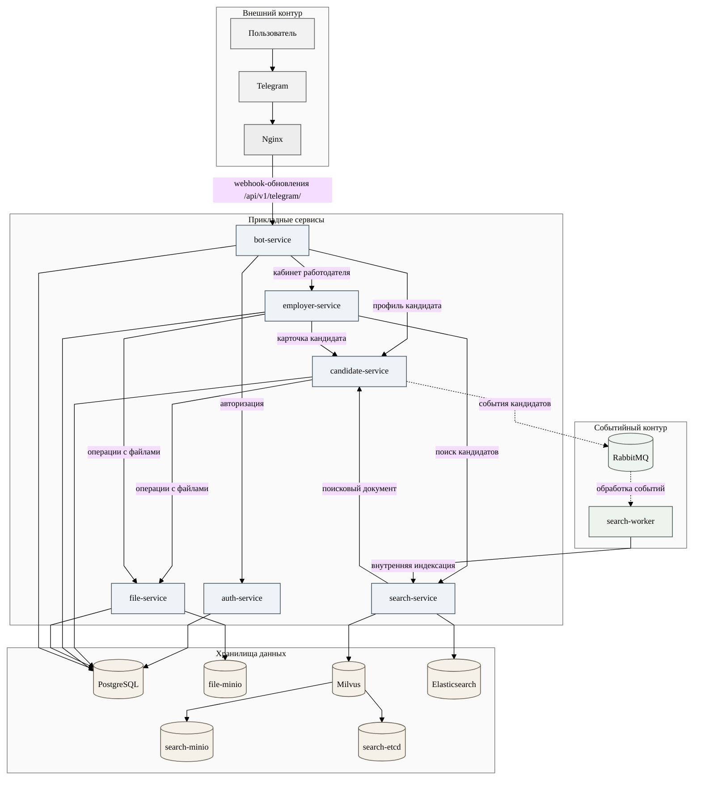

# Рисунок 4.1. Общая архитектура платформы

Схема отражает логическую архитектуру платформы и только те связи сервисов, которые подтверждаются кодом проекта.

```mermaid
%%{init: {
  "theme": "base",
  "themeVariables": {
    "fontFamily": "Times New Roman",
    "fontSize": "14px",
    "primaryTextColor": "#000000",
    "lineColor": "#000000",
    "clusterBkg": "#fafafa",
    "clusterBorder": "#6f6f6f"
  },
  "flowchart": {
    "curve": "linear",
    "nodeSpacing": 28,
    "rankSpacing": 38,
    "diagramPadding": 12
  }
}}%%
flowchart TB
    subgraph EXT["Внешний контур"]
        U["Пользователь"]:::external
        TG["Telegram"]:::external
        NGINX["Nginx"]:::gateway
        U --> TG --> NGINX
    end

    subgraph APP["Прикладные сервисы"]
        BOT["bot-service"]:::service
        AUTH["auth-service"]:::service
        CAND["candidate-service"]:::service
        EMP["employer-service"]:::service
        FILE["file-service"]:::service
        SEARCH["search-service"]:::service
    end

    NGINX -->|"webhook-обновления /api/v1/telegram/"| BOT

    BOT -->|"авторизация"| AUTH
    BOT -->|"профиль кандидата"| CAND
    BOT -->|"кабинет работодателя"| EMP

    CAND -->|"операции с файлами"| FILE
    EMP -->|"операции с файлами"| FILE
    EMP -->|"поиск кандидатов"| SEARCH
    EMP -->|"карточка кандидата"| CAND
    SEARCH -->|"поисковый документ"| CAND

    subgraph EVENT["Событийный контур"]
        RMQ[("RabbitMQ")]:::queue
        SW["search-worker"]:::worker
    end

    CAND -. "события кандидатов" .-> RMQ
    RMQ -. "обработка событий" .-> SW
    SW -->|"внутренняя индексация"| SEARCH

    subgraph DATA["Хранилища данных"]
        PG[("PostgreSQL")]:::storage
        FMINIO[("file-minio")]:::storage
        MILVUS[("Milvus")]:::storage
        ES[("Elasticsearch")]:::storage
        SMINIO[("search-minio")]:::storage
        ETCD[("search-etcd")]:::storage
    end

    AUTH --> PG
    CAND --> PG
    EMP --> PG
    FILE --> PG
    BOT --> PG

    FILE --> FMINIO
    SEARCH --> ES
    SEARCH --> MILVUS
    MILVUS --> SMINIO
    MILVUS --> ETCD

    classDef service fill:#eef3f8,stroke:#4f5b66,stroke-width:1.2px,color:#000000;
    classDef worker fill:#edf3ed,stroke:#56625a,stroke-width:1.2px,color:#000000;
    classDef storage fill:#f6f1e8,stroke:#6b6255,stroke-width:1.2px,color:#000000;
    classDef queue fill:#eef4ef,stroke:#58645b,stroke-width:1.2px,color:#000000;
    classDef external fill:#f2f2f2,stroke:#666666,stroke-width:1.2px,color:#000000;
    classDef gateway fill:#ededed,stroke:#5c5c5c,stroke-width:1.2px,color:#000000;
```
