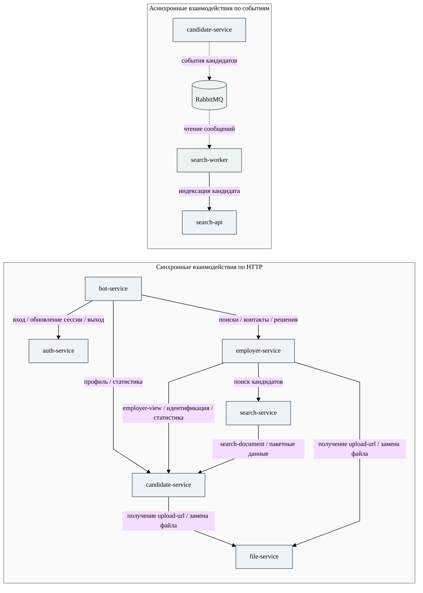

# Рисунок 4.2. Схема взаимодействия сервисов

Схема разделяет синхронный HTTP-контур и асинхронную синхронизацию поискового индекса.

```mermaid
%%{init: {
  "theme": "base",
  "themeVariables": {
    "fontFamily": "Times New Roman",
    "fontSize": "14px",
    "primaryTextColor": "#000000",
    "lineColor": "#000000",
    "clusterBkg": "#fafafa",
    "clusterBorder": "#6f6f6f"
  },
  "flowchart": {
    "curve": "linear",
    "nodeSpacing": 30,
    "rankSpacing": 38
  }
}}%%
flowchart LR
    subgraph SYNC["Синхронные взаимодействия по HTTP"]
        BOT["bot-service"]:::service
        AUTH["auth-service"]:::service
        CAND["candidate-service"]:::service
        EMP["employer-service"]:::service
        FILE["file-service"]:::service
        SEARCH["search-service"]:::service

        BOT -->|"вход / обновление сессии / выход"| AUTH
        BOT -->|"профиль / статистика"| CAND
        BOT -->|"поиски / контакты / решения"| EMP
        CAND -->|"получение upload-url / замена файла"| FILE
        EMP -->|"получение upload-url / замена файла"| FILE
        EMP -->|"поиск кандидатов"| SEARCH
        EMP -->|"employer-view / идентификация / статистика"| CAND
        SEARCH -->|"search-document / пакетные данные"| CAND
    end

    subgraph ASYNC["Асинхронные взаимодействия по событиям"]
        CEV["candidate-service"]:::service
        RMQ[("RabbitMQ")]:::queue
        SW["search-worker"]:::worker
        SAPI["search-api"]:::service

        CEV -. "события кандидатов" .-> RMQ
        RMQ -. "чтение сообщений" .-> SW
        SW -->|"индексация кандидата"| SAPI
    end

    classDef service fill:#eef3f8,stroke:#4f5b66,stroke-width:1.2px,color:#000000;
    classDef worker fill:#edf3ed,stroke:#56625a,stroke-width:1.2px,color:#000000;
    classDef queue fill:#eef4ef,stroke:#58645b,stroke-width:1.2px,color:#000000;
```
