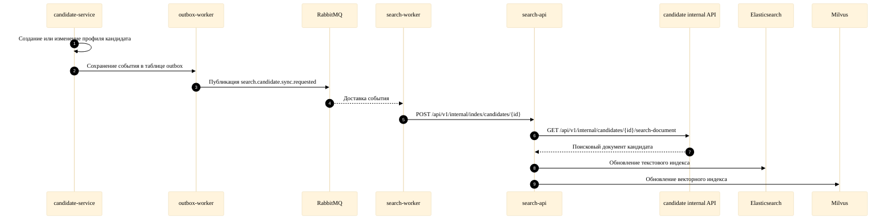

# Рисунок 4.3. Синхронизация поискового индекса по событиям

Диаграмма отражает фактический путь обновления поискового индекса после изменения профиля кандидата.

```mermaid
%%{init: {
  "theme": "base",
  "themeVariables": {
    "fontFamily": "Times New Roman",
    "fontSize": "14px",
    "primaryTextColor": "#000000",
    "lineColor": "#000000",
    "signalColor": "#000000",
    "activationBkgColor": "#f1f3f5",
    "activationBorderColor": "#000000"
  }
}}%%
sequenceDiagram
    autonumber
    participant CAND as candidate-service
    participant OUTBOX as outbox-worker
    participant RMQ as RabbitMQ
    participant SW as search-worker
    participant SEARCH as search-api
    participant CAPI as candidate internal API
    participant ES as Elasticsearch
    participant MV as Milvus

    CAND->>CAND: Создание или изменение профиля кандидата
    CAND->>OUTBOX: Сохранение события в таблице outbox
    OUTBOX->>RMQ: Публикация search.candidate.sync.requested
    RMQ-->>SW: Доставка события
    SW->>SEARCH: POST /api/v1/internal/index/candidates/{id}
    SEARCH->>CAPI: GET /api/v1/internal/candidates/{id}/search-document
    CAPI-->>SEARCH: Поисковый документ кандидата
    SEARCH->>ES: Обновление текстового индекса
    SEARCH->>MV: Обновление векторного индекса
```
