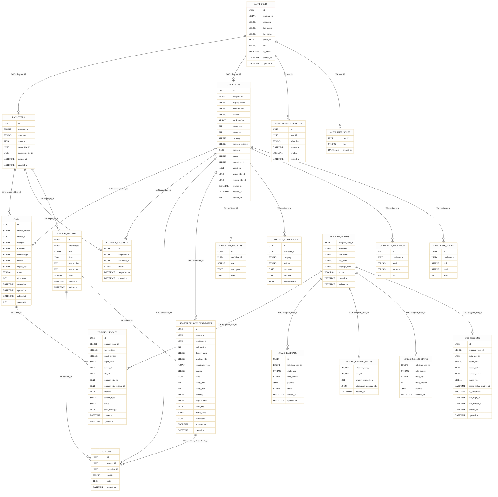

# Рисунок 3.4. Инфологическая ER-диаграмма основных сущностей платформы

Диаграмма построена по фактическим ORM-моделям и Alembic-миграциям сервисов `auth`, `candidate`, `employer`, `bot` и `file`.

Технические таблицы `outbox_messages`, `idempotency_keys`, `callback_contexts`, `processed_updates` и аналогичные служебные структуры исключены, поскольку они не относятся напрямую к предметной модели подбора персонала.

Условные обозначения:

- `FK` — физическая связь на уровне БД, закрепленная внешним ключом.
- `LOG` — логическая связь, существующая на уровне предметной области и кода приложения, но не закрепленная внешним ключом в одной БД.
