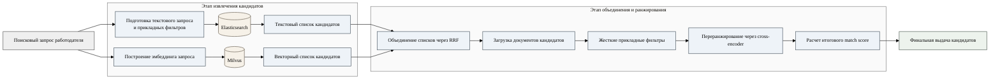

# Рисунок 7.1. Конвейер гибридного поиска

Схема отражает основные этапы гибридного поиска в `search-service`.

```mermaid
%%{init: {
  "theme": "base",
  "themeVariables": {
    "fontFamily": "Times New Roman",
    "fontSize": "14px",
    "primaryTextColor": "#000000",
    "lineColor": "#000000",
    "clusterBkg": "#fafafa",
    "clusterBorder": "#6f6f6f"
  },
  "flowchart": {
    "curve": "linear",
    "nodeSpacing": 28,
    "rankSpacing": 36
  }
}}%%
flowchart LR
    Q["Поисковый запрос работодателя"]:::input

    subgraph RETR["Этап извлечения кандидатов"]
        PREP["Подготовка текстового запроса<br/>и прикладных фильтров"]:::step
        EMB["Построение эмбеддинга запроса"]:::step
        ES[("Elasticsearch")]:::storage
        MV[("Milvus")]:::storage
        LT["Текстовый список кандидатов"]:::step
        LV["Векторный список кандидатов"]:::step
    end

    subgraph RANK["Этап объединения и ранжирования"]
        RRF["Объединение списков через RRF"]:::step
        DOCS["Загрузка документов кандидатов"]:::step
        HF["Жесткие прикладные фильтры"]:::step
        RR["Переранжирование через cross-encoder"]:::step
        SCORE["Расчет итогового match score"]:::step
    end

    OUT["Финальная выдача кандидатов"]:::result

    Q --> PREP
    Q --> EMB
    PREP --> ES --> LT
    EMB --> MV --> LV
    LT --> RRF
    LV --> RRF
    RRF --> DOCS --> HF --> RR --> SCORE --> OUT

    classDef input fill:#efefef,stroke:#5c5c5c,stroke-width:1.2px,color:#000000;
    classDef step fill:#eef3f8,stroke:#4f5b66,stroke-width:1.2px,color:#000000;
    classDef storage fill:#f6f1e8,stroke:#6b6255,stroke-width:1.2px,color:#000000;
    classDef result fill:#edf3ed,stroke:#56625a,stroke-width:1.2px,color:#000000;
```
