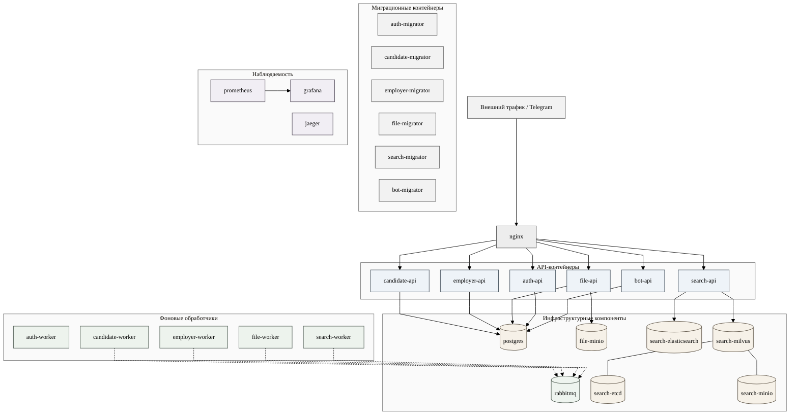

# Рисунок 10.1. Схема контейнерного развертывания

Схема отражает эксплуатационный контур, описанный в `docker-compose`.

```mermaid
%%{init: {
  "theme": "base",
  "themeVariables": {
    "fontFamily": "Times New Roman",
    "fontSize": "14px",
    "primaryTextColor": "#000000",
    "lineColor": "#000000",
    "clusterBkg": "#fafafa",
    "clusterBorder": "#6f6f6f"
  },
  "flowchart": {
    "curve": "linear",
    "nodeSpacing": 26,
    "rankSpacing": 34
  }
}}%%
flowchart TB
    EXT["Внешний трафик / Telegram"]:::external --> NGINX["nginx"]:::gateway

    subgraph API["API-контейнеры"]
        AUTHA["auth-api"]:::service
        CANDA["candidate-api"]:::service
        EMPA["employer-api"]:::service
        FILEA["file-api"]:::service
        SEARCHA["search-api"]:::service
        BOTA["bot-api"]:::service
    end

    subgraph WRK["Фоновые обработчики"]
        AUTHW["auth-worker"]:::worker
        CANDW["candidate-worker"]:::worker
        EMPW["employer-worker"]:::worker
        FILEW["file-worker"]:::worker
        SEARCHW["search-worker"]:::worker
    end

    subgraph MIG["Миграционные контейнеры"]
        AUTHM["auth-migrator"]:::aux
        CANDM["candidate-migrator"]:::aux
        EMPM["employer-migrator"]:::aux
        FILEM["file-migrator"]:::aux
        SEARCHM["search-migrator"]:::aux
        BOTM["bot-migrator"]:::aux
    end

    subgraph INFRA["Инфраструктурные компоненты"]
        PG[("postgres")]:::storage
        RMQ[("rabbitmq")]:::queue
        FMINIO[("file-minio")]:::storage
        ES[("search-elasticsearch")]:::storage
        ETCD[("search-etcd")]:::storage
        SMINIO[("search-minio")]:::storage
        MILVUS[("search-milvus")]:::storage
    end

    subgraph OBS["Наблюдаемость"]
        PROM["prometheus"]:::observe
        GRAF["grafana"]:::observe
        JAEGER["jaeger"]:::observe
    end

    NGINX --> AUTHA
    NGINX --> CANDA
    NGINX --> EMPA
    NGINX --> FILEA
    NGINX --> SEARCHA
    NGINX --> BOTA

    CANDA --> PG
    EMPA --> PG
    FILEA --> PG
    AUTHA --> PG
    BOTA --> PG
    FILEA --> FMINIO
    SEARCHA --> ES
    SEARCHA --> MILVUS
    MILVUS --- ETCD
    MILVUS --- SMINIO
    CANDW -.-> RMQ
    EMPW -.-> RMQ
    FILEW -.-> RMQ
    SEARCHW -.-> RMQ
    PROM --> GRAF

    classDef service fill:#eef3f8,stroke:#4f5b66,stroke-width:1.2px,color:#000000;
    classDef worker fill:#edf3ed,stroke:#56625a,stroke-width:1.2px,color:#000000;
    classDef aux fill:#f2f2f2,stroke:#666666,stroke-width:1.2px,color:#000000;
    classDef storage fill:#f6f1e8,stroke:#6b6255,stroke-width:1.2px,color:#000000;
    classDef queue fill:#eef4ef,stroke:#58645b,stroke-width:1.2px,color:#000000;
    classDef observe fill:#f1eef4,stroke:#635b69,stroke-width:1.2px,color:#000000;
    classDef external fill:#f2f2f2,stroke:#666666,stroke-width:1.2px,color:#000000;
    classDef gateway fill:#ededed,stroke:#5c5c5c,stroke-width:1.2px,color:#000000;
```
