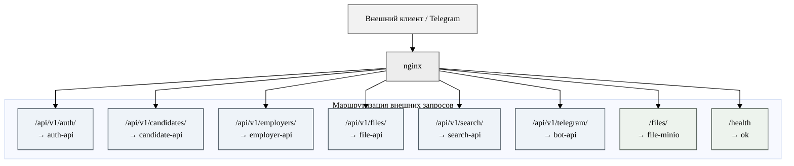

# Рисунок 10.2. Внешняя маршрутизация через Nginx

Схема отражает реальные префиксные маршруты, настроенные во внешнем API-шлюзе.

```mermaid
%%{init: {
  "theme": "base",
  "themeVariables": {
    "fontFamily": "Times New Roman",
    "fontSize": "14px",
    "primaryTextColor": "#000000",
    "lineColor": "#000000"
  },
  "flowchart": {
    "curve": "linear",
    "nodeSpacing": 26,
    "rankSpacing": 32
  }
}}%%
flowchart TB
    CLIENT["Внешний клиент / Telegram"]:::external --> NGINX["nginx"]:::gateway

    subgraph ROUTES["Маршрутизация внешних запросов"]
        AUTH["/api/v1/auth/<br/>→ auth-api"]:::route
        CAND["/api/v1/candidates/<br/>→ candidate-api"]:::route
        EMP["/api/v1/employers/<br/>→ employer-api"]:::route
        FILE["/api/v1/files/<br/>→ file-api"]:::route
        SEARCH["/api/v1/search/<br/>→ search-api"]:::route
        BOT["/api/v1/telegram/<br/>→ bot-api"]:::route
        MINIO["/files/<br/>→ file-minio"]:::special
        HEALTH["/health<br/>→ ok"]:::special
    end

    NGINX --> AUTH
    NGINX --> CAND
    NGINX --> EMP
    NGINX --> FILE
    NGINX --> SEARCH
    NGINX --> BOT
    NGINX --> MINIO
    NGINX --> HEALTH

    classDef route fill:#eef3f8,stroke:#4f5b66,stroke-width:1.2px,color:#000000;
    classDef special fill:#edf3ed,stroke:#56625a,stroke-width:1.2px,color:#000000;
    classDef external fill:#f2f2f2,stroke:#666666,stroke-width:1.2px,color:#000000;
    classDef gateway fill:#ededed,stroke:#5c5c5c,stroke-width:1.2px,color:#000000;
```
