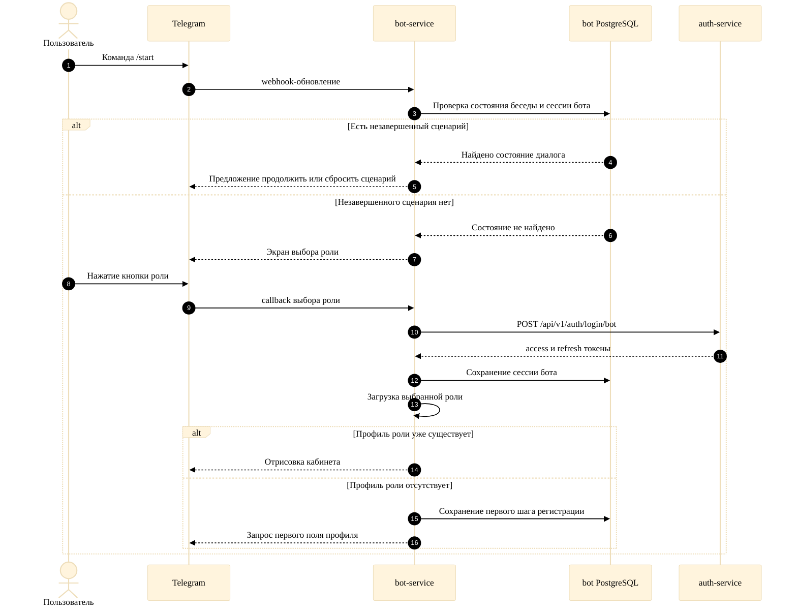

# Рисунок А.1. Вход и авторизация через Telegram

Диаграмма отражает фактический сценарий обработки команды `/start`: сначала бот показывает выбор роли или предлагает продолжить незавершенный сценарий, а внутренний `login via bot` выполняется после выбора роли.

