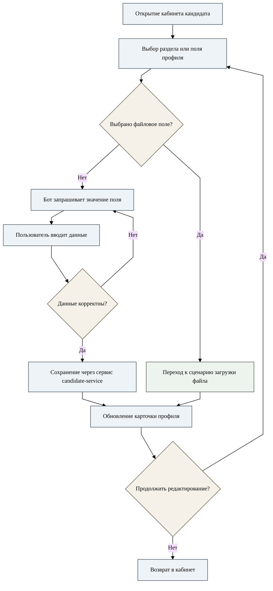

# Рисунок Б.1. Создание и редактирование профиля кандидата

Диаграмма показывает общий сценарий заполнения и изменения профиля кандидата.

```mermaid
%%{init: {
  "theme": "base",
  "themeVariables": {
    "fontFamily": "Times New Roman",
    "fontSize": "14px",
    "primaryTextColor": "#000000",
    "lineColor": "#000000"
  },
  "flowchart": {
    "curve": "linear",
    "nodeSpacing": 24,
    "rankSpacing": 34
  }
}}%%
flowchart TD
    START["Открытие кабинета кандидата"]:::step --> CHOOSE["Выбор раздела или поля профиля"]:::step
    CHOOSE --> KIND{"Выбрано файловое поле?"}:::decision

    KIND -- "Нет" --> ASK["Бот запрашивает значение поля"]:::step
    ASK --> INPUT["Пользователь вводит данные"]:::step
    INPUT --> VALID{"Данные корректны?"}:::decision
    VALID -- "Нет" --> ASK
    VALID -- "Да" --> SAVE["Сохранение через сервис candidate-service"]:::step
    SAVE --> REFRESH["Обновление карточки профиля"]:::step

    KIND -- "Да" --> FILE["Переход к сценарию загрузки файла"]:::file
    FILE --> REFRESH

    REFRESH --> NEXT{"Продолжить редактирование?"}:::decision
    NEXT -- "Да" --> CHOOSE
    NEXT -- "Нет" --> END["Возврат в кабинет"]:::step

    classDef step fill:#eef3f8,stroke:#4f5b66,stroke-width:1.2px,color:#000000;
    classDef decision fill:#f6f1e8,stroke:#6b6255,stroke-width:1.2px,color:#000000;
    classDef file fill:#edf3ed,stroke:#56625a,stroke-width:1.2px,color:#000000;
```
