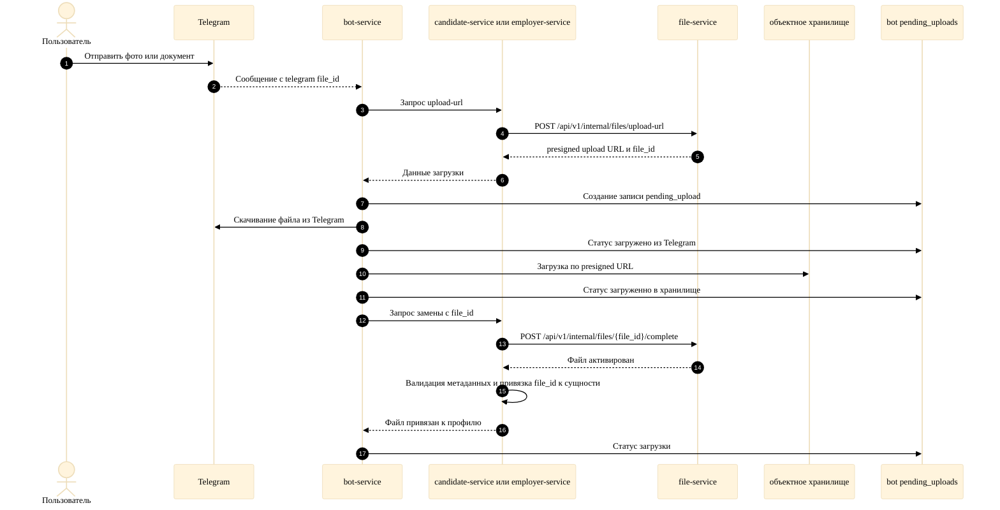

# Рисунок Д.1. Загрузка файлов через Telegram

Диаграмма отражает фактический сценарий загрузки: после передачи файла в объектное хранилище `candidate-service` или `employer-service` дополнительно вызывает `file-service` для активации файла через `/complete`, и только затем связывает `file_id` с профилем.

