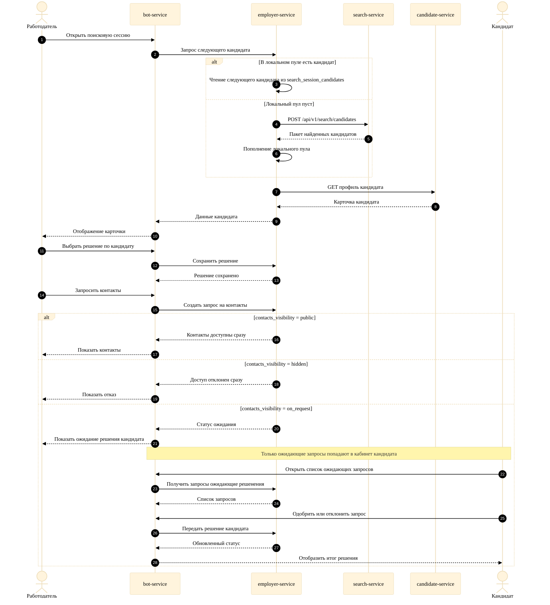

# Рисунок Г.1. Поиск кандидатов и обработка запросов на контакты

Диаграмма отражает текущую реализацию: `employer-service` сначала использует локальный пул кандидатов, а запрос контактов может завершиться сразу или перейти в `pending` в зависимости от `contacts_visibility`.

