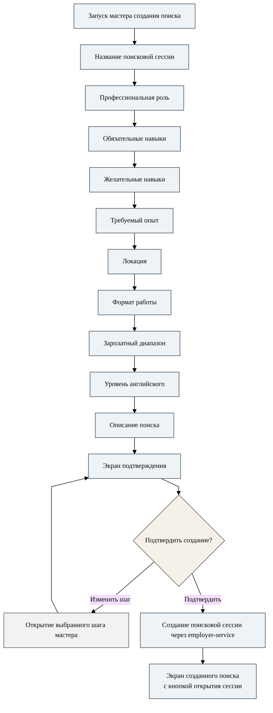

# Рисунок В.1. Создание поисковой сессии работодателя

Диаграмма отражает фактическую логику мастера: на экране подтверждения можно вернуться к выбранному шагу, а после успешного создания бот открывает экран созданной сессии.

